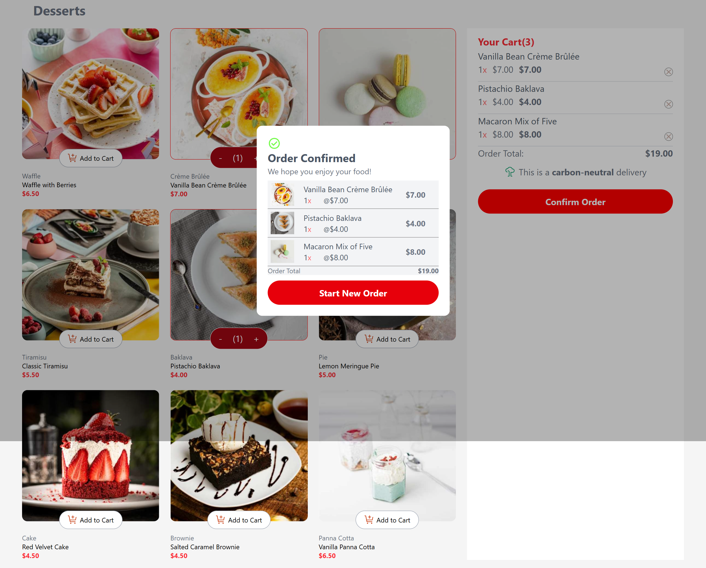

# Frontend Mentor - Product list with cart solution

This is my solution to the [Product list with cart challenge on Frontend Mentor](https://www.frontendmentor.io/challenges/product-list-with-cart-5MmqLVAp_d).

I built this project using React to practice component-based development, state management, array methods, conditional rendering, responsive layouts, and handling user interactions in a real-world shopping cart interface.

Users should be able to:

- Add products to the cart
- Remove products from the cart
- Increase and decrease product quantities
- See the total number of items in the cart
- See the total price of the order
- See an order confirmation modal after confirming an order
- Start a new order and reset the cart
- See a red border around products that have been added to the cart
- View the optimal layout depending on their device's screen size
- See hover and focus states for interactive elements

### Screenshot

### Links

- Solution URL: [Frontend Mentor solution URL](https://github.com/okedo01/products)
- Live Site URL: [Add your live site URL here](https://your-live-site-url.com)

## My process

### Built with

- Semantic HTML5 markup
- CSS
- Flexbox
- CSS Grid
- TailwindCSS
- Responsive design
- Mobile-first approach
- JavaScript
- React
- React Hooks
- `useState`
- `useEffect`
- Array methods such as `map()`, `filter()`, `find()`, and `reduce()`
- Conditional rendering
- Vite

### What I learned

This project helped me understand how to build a real interactive application using React rather than simply creating a static interface.

One of the main things I learned was how to keep shared state in the appropriate parent component. The cart state lives in `App` because both the product components and the cart need access to the same data.
